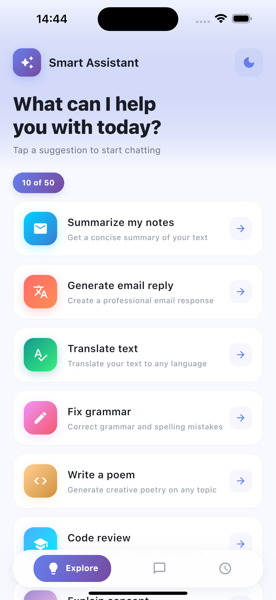
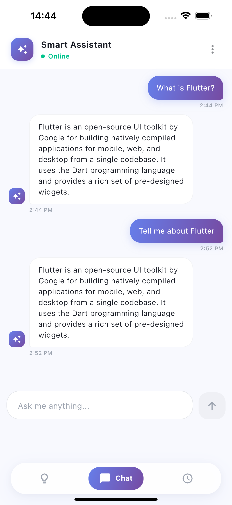
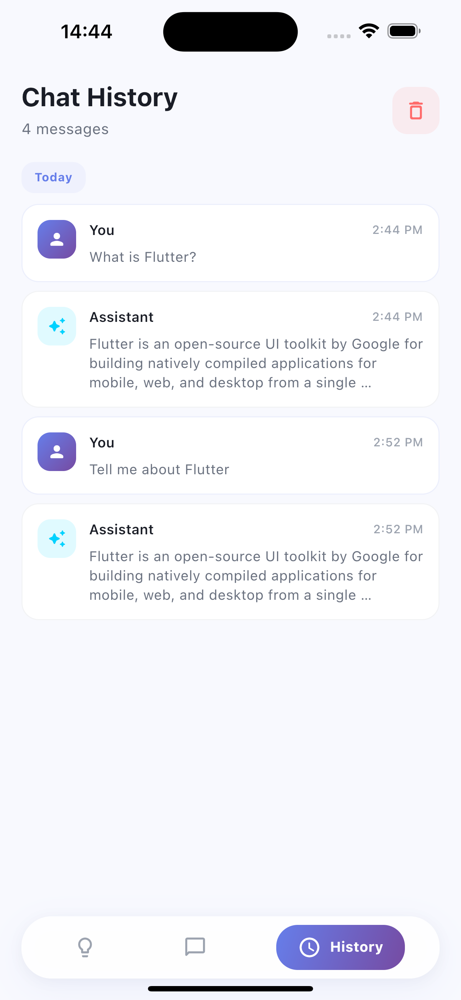
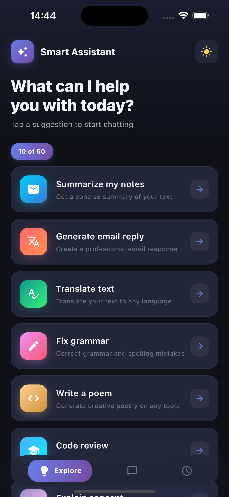
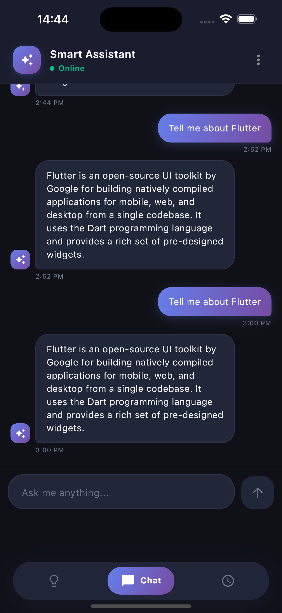
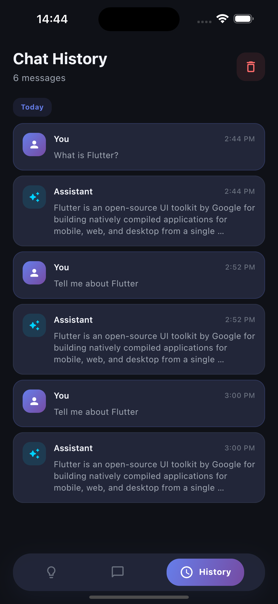

# Smart Assistant App

A Flutter-based Smart Assistant application featuring chat functionality, suggestions with pagination, and chat history with offline support. Built with **GetX** for state management, dependency injection, and routing.

## Features

- **Home Screen** — Browse AI assistant suggestions with infinite scroll pagination
- **Chat Screen** — Interactive chat UI with typing indicators, slide-in animations, and quick action chips
- **History Screen** — View and manage past chat conversations (persisted offline via Hive)
- **Dark Mode** — Full light/dark theme support with a toggle
- **Offline Storage** — Chat history saved locally using Hive for offline access
- **Animations** — Smooth chat bubble slide-in/fade animations, bouncing typing indicator
- **Shimmer Loading** — Skeleton loading placeholders while data is fetched
- **Pull to Refresh** — Refresh suggestions list with a swipe gesture

## Screenshots

| Home (Light) | Chat (Light) | History (Light) |
|:---:|:---:|:---:|
|  |  |  |

| Home (Dark) | Chat (Dark) | History (Dark) |
|:---:|:---:|:---:|
|  |  |  |

> **Note:** Add screenshots to a `screenshots/` folder in the project root.

## Architecture

This project follows a **DDD (Domain-Driven Design) 4-Layer Architecture** with a feature-first folder structure and **GetX** for state management, DI, and routing.

### Folder Structure

```
lib/
├── main.dart                    # App entry point
├── routes/                      # Centralized routing
│   ├── app_routes.dart          # Route name constants
│   └── app_pages.dart           # GetPage definitions
├── config/                      # App configuration
│   └── app_binding.dart         # GetX bindings (DI)
├── common/                      # Shared utilities
│   ├── network/
│   │   ├── exceptions.dart      # ServerException, CacheException
│   │   └── failures.dart        # ServerFailure, CacheFailure, NetworkFailure
│   └── themes/
│       ├── app_theme.dart       # Light/dark ThemeData, AppColors
│       └── theme_controller.dart
│
├── suggestions/                 # Feature module
│   ├── application/
│   │   └── controllers/         # SuggestionsController (GetX)
│   ├── domain/
│   │   ├── data_class/          # Suggestion, Pagination, SuggestionsResponse
│   │   └── repositories/        # SuggestionsRepository (abstract)
│   ├── infrastructure/
│   │   ├── datasources/         # SuggestionsRemoteDataSourceImpl (mock)
│   │   └── repository/          # SuggestionsRepositoryImpl
│   └── presentation/
│       ├── pages/               # HomeScreen
│       └── widgets/             # SuggestionCard, SuggestionShimmer
│
├── chat/                        # Feature module
│   ├── application/
│   │   └── controllers/         # ChatController (GetX)
│   ├── domain/
│   │   ├── data_class/          # ChatMessage (Hive-adapted)
│   │   └── repositories/        # ChatRepository (abstract)
│   ├── infrastructure/
│   │   ├── datasources/         # ChatRemoteDataSourceImpl, ChatLocalDataSourceImpl
│   │   └── repository/          # ChatRepositoryImpl
│   └── presentation/
│       ├── pages/               # ChatScreen
│       └── widgets/             # ChatBubble, ChatInput, TypingIndicator
│
├── history/                     # Feature module
│   ├── application/
│   │   └── controllers/         # HistoryController (GetX)
│   └── presentation/
│       └── pages/               # HistoryScreen
│
└── navigation/                  # Feature module
    ├── application/
    │   └── controllers/         # NavigationController (GetX)
    └── presentation/
        └── pages/               # NavigationShell (bottom nav)
```

### 4 Layers per Feature

| Layer | Folder | Responsibility |
|-------|--------|---------------|
| **Application** | `application/` | GetX Controllers, bindings, business logic orchestration |
| **Domain** | `domain/` | Data classes (entities), abstract repository interfaces — pure Dart, no framework deps |
| **Infrastructure** | `infrastructure/` | Repository implementations, data sources (remote mock + local Hive), DTOs |
| **Presentation** | `presentation/` | UI screens, reusable widgets, pages |

### State Management (GetX)

| Controller | Responsibility |
|---|---|
| `ThemeController` | Toggles light/dark mode via `Get.changeThemeMode()` |
| `SuggestionsController` | Handles paginated suggestion loading with `.obs` reactive variables |
| `ChatController` | Manages chat messages, sending, and local persistence |
| `HistoryController` | Loads and clears offline chat history |
| `NavigationController` | Manages bottom navigation tab switching |

### Dependency Injection (GetX Bindings)

All dependencies are registered in `AppBinding` using `Get.lazyPut()` with `fenix: true` for automatic recreation:

```
Data Sources → Repositories → Controllers
```

## Tech Stack

| Package | Purpose |
|---------|---------|
| `get` | State management, DI, routing (GetX) |
| `dio` | HTTP client (ready for real API integration) |
| `hive` / `hive_flutter` | Offline local storage for chat history |
| `shimmer` | Loading skeleton animations |
| `intl` | Date/time formatting |

## Setup & Run

### Prerequisites

- Flutter SDK (3.7.x or compatible)
- Dart SDK (2.19.x)

### Steps

```bash
# Clone the repository
git clone https://github.com/harshal-bonde/smart_assistant.git
cd smart_assistant

# Install dependencies
flutter pub get

# Run the app
flutter run
```

### Build

```bash
# Android APK
flutter build apk

# iOS
flutter build ios
```

## Testing

The project includes **67 tests** covering domain models, data sources, repositories, and controllers.

```bash
# Run all tests
flutter test

# Run with verbose output
flutter test --reporter expanded
```

### Test Coverage

| Category | Tests | What's Covered |
|---|---|---|
| **Domain Models** | 12 | ChatMessage, Suggestion, Pagination, SuggestionsResponse, Failures, Exceptions |
| **Data Sources** | 11 | SuggestionsRemoteDataSource (pagination, limits), ChatRemoteDataSource (keyword matching, history) |
| **Repositories** | 12 | SuggestionsRepositoryImpl, ChatRepositoryImpl (success/error paths, local storage) |
| **Controllers** | 29 | SuggestionsController, ChatController, HistoryController, ThemeController, NavigationController |
| **Widget Tests** | 3 | SuggestionCard rendering, tap handling, icon display |

### Test Approach

- **Hand-rolled fakes** (no mocking frameworks) for data sources and repositories
- **AAA pattern** (Arrange-Act-Assert) for clear test structure
- **GetX test mode** (`Get.testMode = true`) for controller tests without a running app

## API Simulation

Since no real backend exists, the app uses **mock data sources** that simulate API behavior:

- **GET /suggestions** — Returns 50 suggestions with pagination (10 per page), with simulated network delay
- **POST /chat** — Returns context-aware responses based on keywords (Flutter, Dart, BLoC, etc.)
- **GET /chat/history** — Returns sample conversation history

The mock data sources can be easily swapped with real HTTP implementations by replacing the data source classes.

## Bonus Features Implemented

- [x] Offline chat history (Hive)
- [x] Dark mode support
- [x] Chat animations (bubble slide-in, typing indicator)
- [x] Shimmer loading skeletons
- [x] Pull-to-refresh on suggestions
- [x] Quick action chips in empty chat state
- [x] Unit & widget tests (67 tests)
